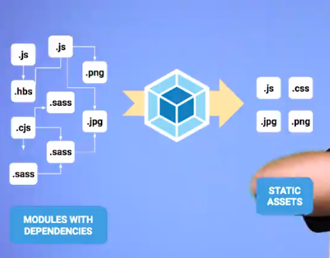

# Webpack notes

## Introducción a Webpack
Webpack es un empaquetador de módulos para aplicaciones modernas en JS



### User Experience Vs. Developer Experience

En user experience buscamos una app que:
- Funcione
- Sea rápida
- Cumpla sus necesides
- Se actualice
- Responda a sus interacciones
- Producto de calidad

En developer experience se busca:

- Escribir apps de manera eficiente
- Tener código limpio
- Aplicar tecnología para resolver problemas
- Tener un conjunto de reglas y convenciones
- Entorno de desarrollo optimizado en productividad

### Por qué webpack?

Lograr todas estas condiciones resulta en un entorno de desarrollo dificil de mantener, dificil de escalar y en general, con un developer experience pobre.
Webpack es un middleman que entiende la forma en la que enlazamos todos los modulos y assets del proyecto, y los convierte a assets listos para producción.

## Instalando webpack
Webpack desde la versión 4 se puede instalar con npm
```
npm install webpack webpack-cli --save-dev
```

## Usando webpack
La forma mas facil de usar webpack:
```
npx webpack --entry <entryModule> --output <outputModule> --mode production
```

Cambiando el mode a development genera un bundle legible para debuggear
```
npx webpack --entry <entryModule> --output <outputModule> --mode development
```

## Usando webpack.config
Para extender la configuración de webpack se puede crear un archivo de configuración que por defecto se llama `webpack.config.js`. Un archivo de configuración con este contenido:
```javascript
const path = require('path');
module.exports = {
  entry: './index.js',
  output: {
    path: path.resolve(__dirname),
    filename: 'bundle.js'
  },
  mode: 'development'
}
```
hace que ejecutar:
```
npx webpack
```
sea equivalente a:
```
npx webpack --entry ./index.js --output ./bundle.js --mode development
```
